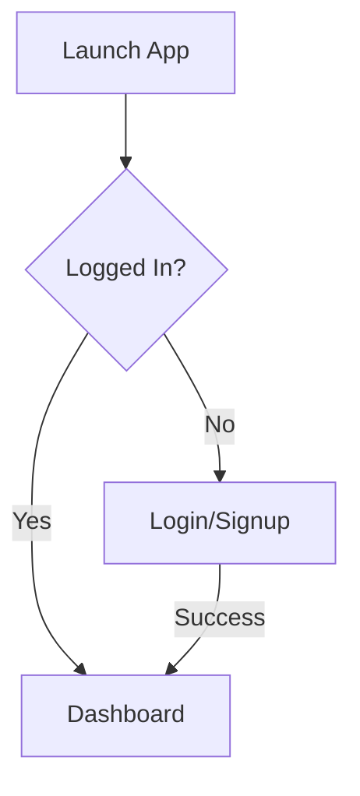
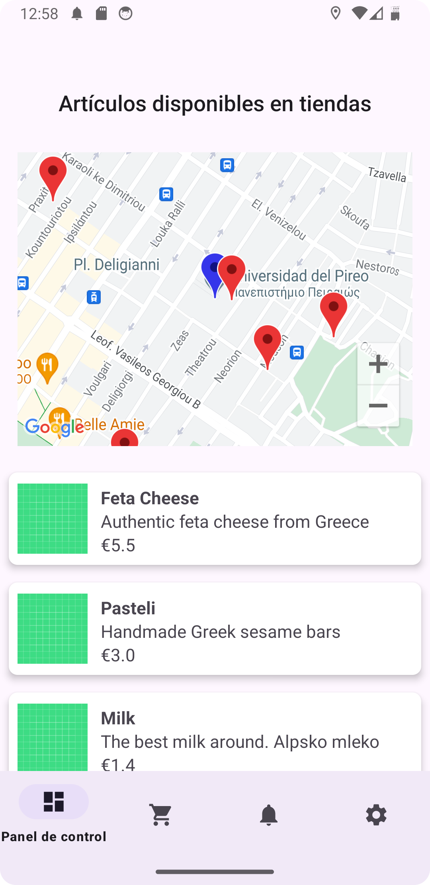
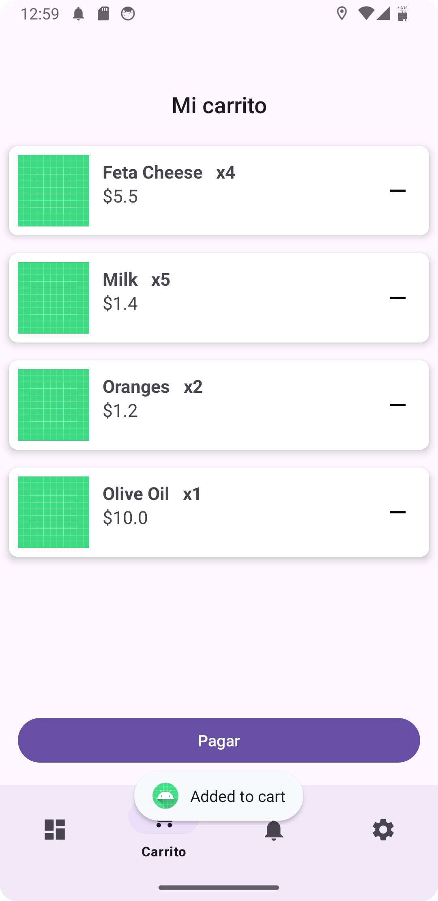
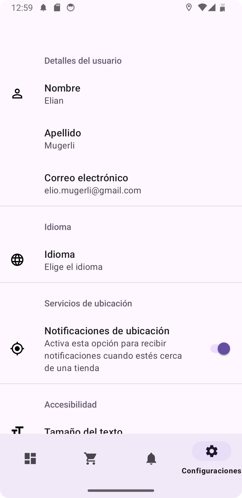

# UnipiPLIShopping

## Description  
**UnipiPLIShopping** is an Android shopping application that enables users to discover products, receive location-based notifications, and manage purchases. Key features include:  
- **Real-time product browsing** with a map view of store locations  
- **Location-aware notifications** when near product stores (200m radius)  
- **Cart management** with quantity tracking  
- **Order history** persisted in Firestore  
- **Customizable UI** (theme, text size, notifications)  
- **User authentication** via Firebase  

---

## Workflows  

### 1. **User Authentication**  

### 2. **Product Browsing**
- View products in RecyclerView
- Tap items for detailed view
- Interactive Google Map with store markers
- Real-time Firestore synchronization

### 4. **Order Processing**
- Cart items converted to Firestore receipts
- Stores: User ID, Timestamp, Product Quantities
- Automatic cart clearance post-purchase

### 6. **Settings Management**
- User profile display (name, email)
- Theme customization (day/night mode)
- Text size scaling (S/M/L)
- Notification toggles
- Language selection

## Technologies used
### Cloud Firestore
- Products, Users, Receipts are stored in the corresponding tables of the database
- Firestore ensures the app remains up-to-date with the latest stories without requiring manual updates or redeployment.

#### Document example:
```json
"JgK1qCJhcpghPqoHROXi": 
    {
        "description": "Handmade Greek sesame bars",
        "name": "Pasteli",
        "price": 3.0,
        "release_date": "January 28, 2025 at 12:00:00 AM UTC+2",
        "store_id": 8,
        "store_location": [37.939600, 23.647500]
    }
```
### SharedPreferences, Preference Library
All the possible settings like Day/Night Mode, Text size, language settings and notification toggles.

### Authentication
Using Firebase Authentication

### Mapping
- Google Maps SDK
- Geofencing API

## Architecture
- MVVM (Model-View-ViewModel) pattern
- Repository pattern for data management
- Singleton CartManager for state persistence
- Permission-aware location services

## Images



